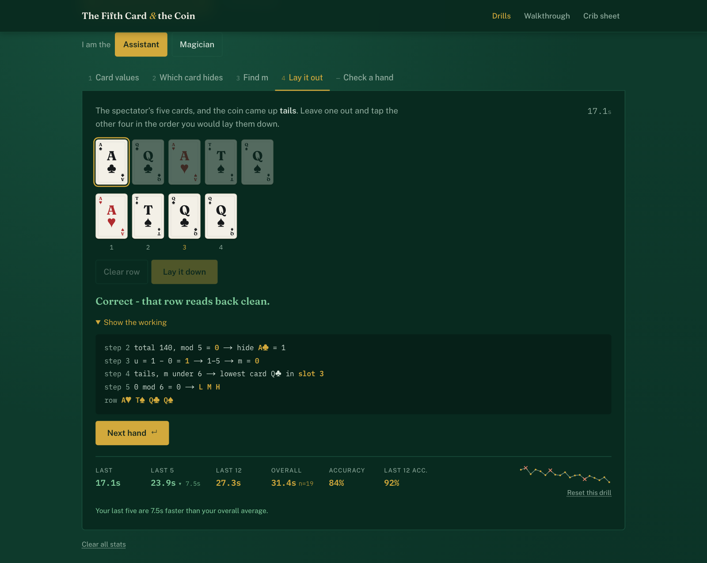
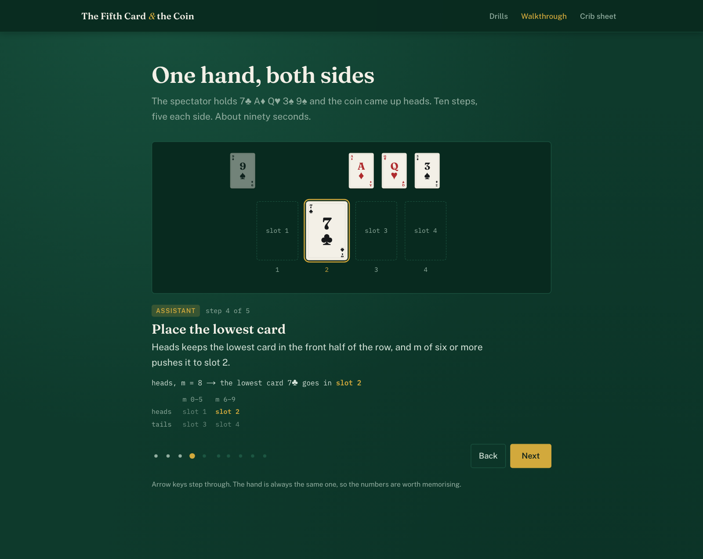
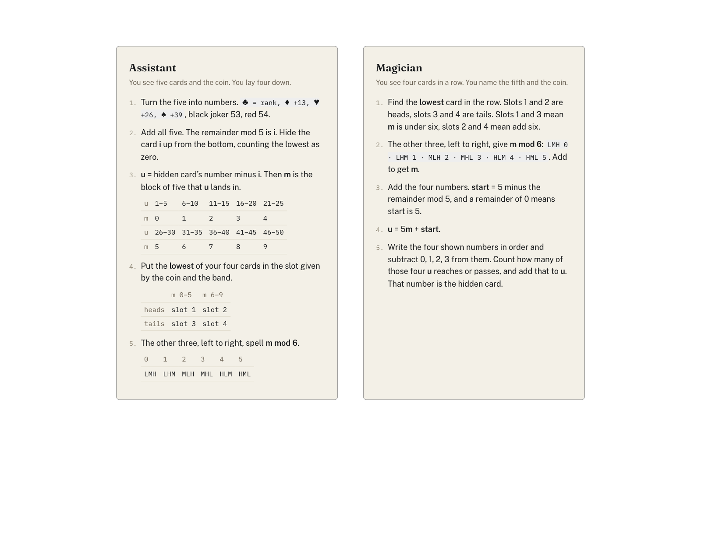
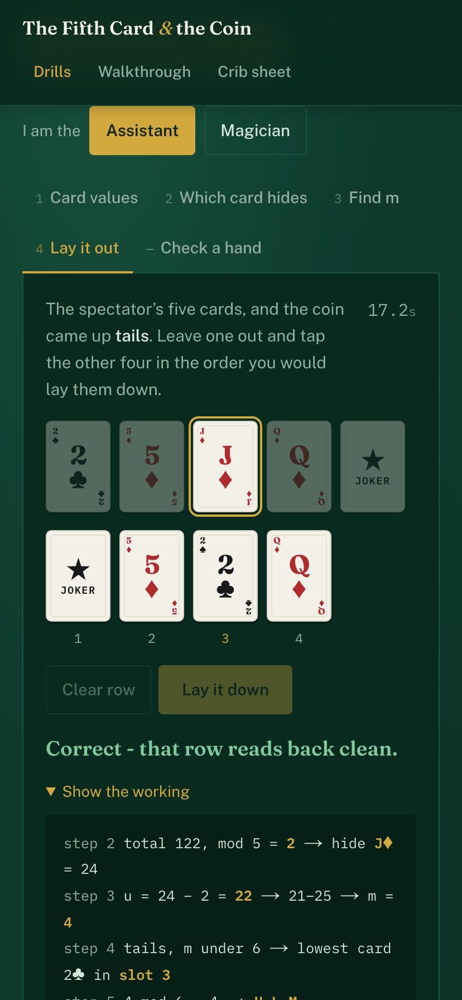
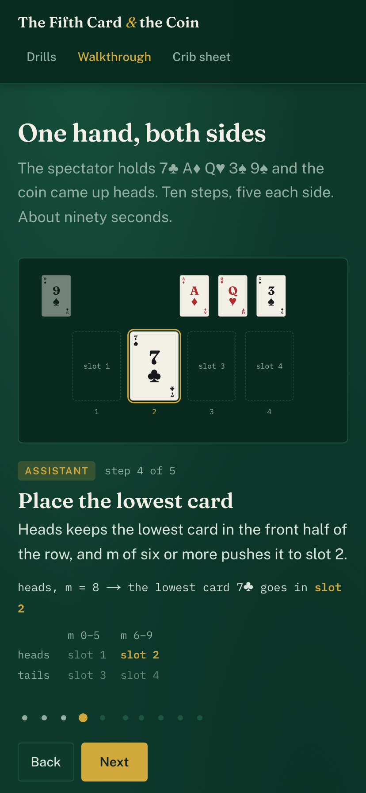

# The Fifth Card & the Coin

**Four cards name the fifth. The bandwidth left over calls the coin.**

A spectator takes five cards out of a 54-card deck, both jokers in, and flips a coin. The
assistant looks at the five, picks one to keep back, and lays the other four face up in a row.
Nothing is said, nothing is marked, no card is turned, angled or nudged. The magician walks in,
reads the row, names the fifth card and calls heads or tails.

It is not a gimmick. The row is a message, the order of the cards is the alphabet, and the whole
thing is forced by arithmetic. This site is where the two of you learn to send it.

**Live:** https://fifth-and-flip.vercel.app



---

## What the site is

Three surfaces, all built around one verified encoder in `lib/trick.ts`.

**Drills.** A ladder per role, and you only ever see your own. The assistant works up through card
values, which card to hide, finding `m`, and laying the row down. The magician works up through
card values, reading the row, turning `m` into a card, and calling it cold. Every question ends
with the working: the actual numbers, step by step, the same way you would do it at a table. A
shared *Check a hand* solver settles arguments.

**Timing.** Practice is against a live clock, in tenths, and each drill keeps an ordered history
per role: last attempt, last 5, last 12, overall, accuracy overall and over the last 12, plus a
sparkline of the last two dozen attempts with the misses crossed. Wrong answers stay in the
timing averages, because a fast wrong call is not a fast drill. It all lives in `localStorage`,
so nothing leaves the machine.

**The walkthrough.** One fixed hand, ten steps, about ninety seconds, [at `/learn`](https://fifth-and-flip.vercel.app/learn).
One idea per step and one sentence of text; the animation carries the rest. Cards travel rather
than cross-fade, so you watch the 7♣ physically take slot 2 instead of being told that it does.
It honours `prefers-reduced-motion` with the same ten steps and no movement.

| Walkthrough, step 4 of the assistant's five | The crib sheet, print-ready |
| --- | --- |
|  |  |

And it all works one-handed on a phone, which is where people actually rehearse.

<p align="center">
  
  
</p>

---

## How it works

Number the deck 1 to 54: clubs are their rank, diamonds add 13, hearts 26, spades 39, black joker
53, red joker 54.

**The assistant** sorts the five, adds them, and takes the total mod 5. That remainder, call it
`i`, picks the card to hide: `i` up from the lowest, counting the lowest as zero. Then `u` is the
hidden card's number minus `i`, and `m` is the block of five that `u` falls in, so `m` runs 0 to 9.
The **lowest** of the four shown cards goes into the slot given by the coin and by whether `m` is
under six (heads: slot 1 or 2, tails: slot 3 or 4). The other three, left to right, spell `m mod 6`
in low-middle-high.

**The magician** reads the slot of the lowest card for the coin and the band, reads the other three
for `m mod 6`, adds the four numbers on the table for `start = 5 − (sum mod 5)`, gets
`u = 5m + start`, and pushes `u` past the four checkpoints `shown[k] − k` to land on the fifth card.

### Why it has to work

Take the four shown cards out of the deck and renumber the fifty survivors 1 to 50. The cards that
could be hidden behind that particular four are every fifth survivor starting at `start`, and
because fifty divides by five there are always exactly ten of them. `m` says which. The
assistant's subtraction skips the counting: exactly `i` of the shown cards sit below the hidden
card, so `u = h − i` *is* its position among the survivors. The checkpoints run that conversion
backwards in one pass.

The budget is a counting fact. Four cards shown in order out of five carry `5 × 4! = 120`
distinguishable signals: 24 from the arrangement, times five for the choice of which card to
withhold. Naming one card out of the fifty survivors costs 100. The coin fits in the slack; a
three-way choice never could.

### Credit

The five-card trick is William Fitch Cheney's, from the 1950s. The sum-mod-5 scheme used here, and
the proof that it stretches to a 124-card deck, are in Michael Kleber's
["The Best Card Trick"](https://doi.org/10.1007/BF03025305), *Mathematical Intelligencer* 24 #1
(2002), 9–11, which credits the scheme to Elwyn Berlekamp. The deck-plus-a-coin variant is
Berlekamp's too, noted at the end of that paper. This is the 54-card version of it, jokers
included.

---

## Verified, not asserted

`lib/trick.ts` is pure and framework-free, which is what makes its tests worth anything:

```
npm test
```

```
✓ round trip > decodes 200,000 random hands back to the hidden card and the coin
✓ round trip > keeps u in [1,50] and m in [0,9] across the same run
✓ the menu of ten > has exactly ten entries and its m-th entry is the hidden card
✓ the menu of ten > gives a ten-entry menu for all 316,251 four-card subsets of the deck
✓ golden case > lays out Q♥ 7♣ A♦ 3♠ on heads
✓ golden case > lays out Q♥ A♦ 3♠ 7♣ on tails
✓ golden case > walks the magician back to 9♠ through start, u and the checkpoints
```

200,000 random round trips, an independently constructed candidate menu checked 20,000 times, and
every one of the 316,251 four-card subsets of the deck swept for a ten-entry menu. Zero failures,
about two seconds.

## Running it

```bash
npm install
npm run dev          # http://localhost:3000
```

```bash
npm test             # the property tests
npm run lint         # eslint, expected to be clean
npm run typecheck    # tsc --noEmit
npm run build        # production build
npm run screenshots  # build first: boots :4321 and rewrites docs/screenshots
```

Next.js (App Router), TypeScript, Tailwind, Motion for the animation, Vitest for the tests,
Playwright for the screenshots. No component library.

`prototype.html` is the original single-file version that this was ported from. It stays in the
repo root as the historical reference and the spec of record for the algorithm.

## Licence

MIT. See [LICENSE](LICENSE).
